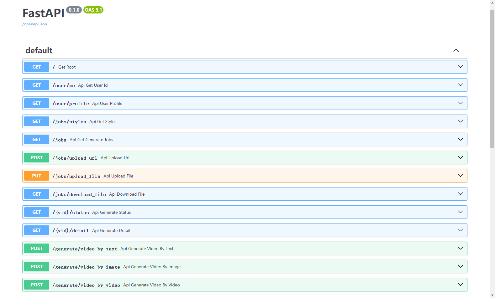

# 非官方 Haiper API

这一个基于 Python和 FastAPI 的非官方 Haiper API，目前支持生成视频功能。  
自带维护 token 与保活功能，无需担心 token 过期问题。

### 特点

- token 自动维护与保活
- 全异步，速度快，适合后期扩展
- 代码简单，易于维护，方便二次开发

### 使用

#### 配置

编辑 `.env.example` 文件，重命名为 `.env`，填写 session_id 和 refresh_token

这些先从浏览器中获取，后期会自动保活。
注意：会话保活需要科学上网，因为访问的是googleapi

#打开F12，使用google登录，找到下面的请求：
#https://identitytoolkit.googleapis.com/v1/accounts:signInWithIdp?key=xxxxxxxxxx
#获取key(Session_ID)、idToken以及refreshToken
#idToken可以不需要(如果同时使用浏览器,最好保持一致,否则浏览器会不可访问,token会被刷新)，refreshToken是必须的，后续可以保活


#### 运行

安装依赖

```bash
pip3 install -r requirements.txt
```

这一部分，自行参考 FastAPI 文档

```bash
uvicorn main:app --port 8001
```

#### Docker

```bash
docker compose build && docker compose up
```

#### 文档

搭建服务后访问 /docs




